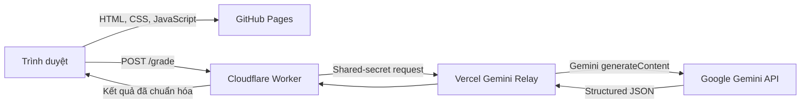

# Essay Grader Updated

Ứng dụng web hỗ trợ luyện thi với hai chức năng chính:

- Làm bài trắc nghiệm từ ngân hàng câu hỏi Excel.
- Chấm bài nghị luận xã hội bằng Google Gemini và trả về nhận xét có cấu trúc.

Dự án được xây dựng theo kiến trúc frontend tĩnh kết hợp Cloudflare Worker API.
Các request Gemini được chuyển qua một Vercel relay đặt tại Hoa Kỳ nhằm bảo đảm
khả năng truy cập API ổn định.

## Tính năng

### Luyện trắc nghiệm

- Nhập câu hỏi từ tệp `.xlsx` hoặc `.xls`.
- Hỗ trợ các chế độ ôn tập, thử thách và học đề cương.
- Tạo đề ngẫu nhiên với số lượng câu hỏi tùy chọn.
- Đồng hồ đếm ngược và bảng điều hướng câu hỏi.
- Thống kê kết quả, tốc độ làm bài và xem lại đáp án.
- Hỗ trợ giao diện sáng/tối.

### Chấm bài nghị luận bằng AI

- Kiểm tra tối thiểu 500 từ trước khi gửi bài.
- Giới hạn nội dung tối đa 30.000 ký tự.
- Chấm theo rubric bảy tiêu chí với tổng điểm 10.
- Phân tích điểm mạnh, điểm yếu và từng phần của bài viết.
- Đề xuất ý cần bổ sung, lỗi diễn đạt và đoạn văn sửa mẫu.
- Lưu bản nháp trong `localStorage` của trình duyệt.
- Yêu cầu Gemini trả về structured JSON theo schema cố định.

> Kết quả AI phục vụ mục đích luyện tập và nên được giáo viên kiểm tra trước khi
> sử dụng trong đánh giá chính thức.

## Kiến trúc hệ thống



Cloudflare Worker không gửi API key xuống trình duyệt. Worker nhận bài viết,
kiểm tra dữ liệu, tạo prompt và schema, sau đó gọi Gemini thông qua relay.

## Công nghệ

| Thành phần | Công nghệ |
| --- | --- |
| Giao diện | HTML5, CSS3, JavaScript thuần |
| Đọc Excel | SheetJS `xlsx` 0.18.5 |
| Font chữ | Google Fonts: Fredoka và Nunito |
| Frontend hosting | GitHub Pages |
| Backend API | Cloudflare Workers |
| Công cụ deploy Worker | Wrangler 4 |
| AI | Google Gemini `gemini-3-flash-preview` |
| Structured output | `responseMimeType` và `responseJsonSchema` |
| Relay | Vercel Edge Function tại `iad1` |
| Lưu trạng thái phía client | Web Storage API (`localStorage`) |

## Cấu trúc dự án

```text
essay-grader-updated/
├── index.html           # Giao diện ứng dụng
├── style.css            # Thiết kế responsive và theme
├── script.js            # Logic trắc nghiệm và đọc Excel
├── essay-grader.js      # Logic nhập bài, gọi API và hiển thị kết quả
├── worker.js            # Cloudflare Worker API
├── wrangler.toml        # Cấu hình deploy Worker
├── option.xlsx          # Tệp câu hỏi mẫu
├── README.md            # Ghi chú triển khai Gemini
├── package.json
└── README.md
```

## Yêu cầu môi trường

- Node.js phiên bản LTS hoặc mới hơn.
- npm.
- Tài khoản Cloudflare có quyền deploy Workers.
- Gemini API key.
- Vercel relay đã được deploy và cấu hình shared secret.

## Cài đặt

```powershell
git clone <repository-url>
cd essay-grader-updated
npm install
```

## Chạy frontend cục bộ

Frontend cần chạy từ một HTTP server để CORS và các API trình duyệt hoạt động
đúng:

```powershell
python -m http.server 5500
```

Sau đó mở:

```text
http://localhost:5500
```

Các origin phát triển mặc định được Worker cho phép:

- `http://localhost:5500`
- `http://127.0.0.1:5500`

## Cấu hình Cloudflare Worker

Các biến không nhạy cảm nằm trong `wrangler.toml`:

| Biến | Mục đích |
| --- | --- |
| `GEMINI_API_BASE_URL` | Base URL của Gemini relay |
| `GEMINI_MODELS` | Danh sách model dự phòng, phân tách bằng dấu phẩy |
| `GEMINI_MODEL_TIMEOUT_MS` | Thời gian chờ mỗi request |
| `GEMINI_MAX_OUTPUT_TOKENS` | Số token đầu ra tối đa |
| `GEMINI_RETRIES_PER_MODEL` | Số lần thử cho mỗi model |
| `GEMINI_THINKING_LEVEL` | Mức suy luận của model |

Thiết lập secrets bằng Wrangler:

```powershell
npx.cmd wrangler secret put GEMINI_API_KEY
npx.cmd wrangler secret put GEMINI_RELAY_SECRET
```

- `GEMINI_API_KEY`: API key do Google cấp.
- `GEMINI_RELAY_SECRET`: phải trùng với `RELAY_SECRET` trên Vercel.

Không lưu secrets trong source code, `wrangler.toml` hoặc Git.

## Chạy Worker cục bộ

```powershell
npx.cmd wrangler dev
```

Khi cần dùng Worker local, cập nhật hằng số `WORKER_URL` trong
`essay-grader.js` sang URL mà Wrangler cung cấp.

## API

### `GET /health`

Kiểm tra trạng thái dịch vụ và cấu hình runtime.

```powershell
Invoke-RestMethod `
  -Uri "https://your-cloudflable/health"
```

### `POST /grade`

Gửi bài nghị luận để chấm:

```json
{
  "studentAnswer": "Nội dung bài viết tối thiểu 500 từ..."
}
```

Request phải:

- Có `Content-Type: application/json`.
- Đến từ origin được cho phép.
- Có bài viết đạt tối thiểu 500 từ.
- Không vượt quá 30.000 ký tự.

Ví dụ:

```javascript
const response = await fetch(
  "https://your-cloudflable/grade",
  {
    method: "POST",
    headers: { "Content-Type": "application/json" },
    body: JSON.stringify({ studentAnswer }),
  },
);

const result = await response.json();
```

## Định dạng Excel

Sheet đầu tiên của workbook cần có các cột:

| Cột | Nội dung |
| --- | --- |
| `text` | Nội dung câu hỏi |
| `option_0` | Đáp án A |
| `option_1` | Đáp án B |
| `option_2` | Đáp án C |
| `option_3` | Đáp án D |
| `correct` | Đáp án đúng dạng `0–3` hoặc `A–D` |

Tham khảo tệp `option.xlsx` trong repository.

## Kiểm tra và deploy

Kiểm tra bản build Worker:

```powershell
npx.cmd wrangler deploy --dry-run
```

Deploy production:

```powershell
npx.cmd wrangler deploy
```

Production Worker:

```text
https://your-cloudflable.dev
```

## Bảo mật

- Gemini API key chỉ tồn tại trong Cloudflare Worker secrets.
- Relay yêu cầu header `x-relay-secret` trước khi chuyển tiếp request.
- Relay chỉ cho phép đường dẫn bắt đầu bằng `v1beta/models/`.
- Header chứa relay secret được xóa trước khi gọi Google.
- API giới hạn origin, phương thức, kích thước nội dung và kiểu dữ liệu.
- Response không được cache và sử dụng `X-Content-Type-Options: nosniff`.

## Dự án liên quan

`gemini-relay` là dịch vụ trung gian bắt buộc trong cấu hình production hiện
tại. Xem README trong repository relay để biết cách cấu hình Vercel.

## Giấy phép

Dự án hiện khai báo giấy phép ISC trong `package.json`.
